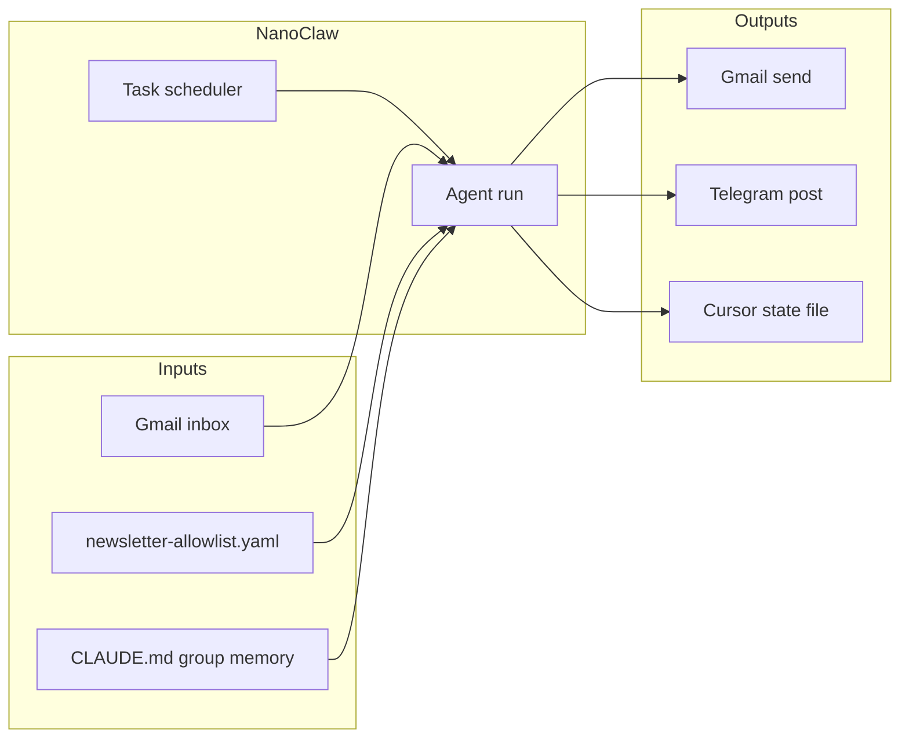

# Steep newsletter digest — design spec

> **Status:** Approved by product owner (2026-04-08).  
> **Next step:** Implementation plan (`docs/superpowers/plans/`) after review of this document.

## 1. Summary

**Steep** is the configuration and documentation home for a **personal newsletter digest** orchestrated by **NanoClaw**. A **daily scheduled NanoClaw task** (default **09:00** in the host’s `TZ` or an explicitly configured IANA timezone) ingests **Gmail** messages from **allowlisted senders/domains**, classifies content into **MUST KNOW**, **INTERESTING FOR ME**, and **FLUFF** using **only the NanoClaw group’s `CLAUDE.md`** as the reader profile, composes **one canonical digest**, and delivers it **twice**: **send via Gmail** and **post via Telegram**.

## 2. Goals

- **Single combined digest** per run: scannable, beautiful enough to read daily, with **clear sectioning** and **source links**.
- **Predictable inputs:** only mail matching the **versioned allowlist** in this repo.
- **No duplicate “profile” file** in `steep`: prioritization and taste live in **`CLAUDE.md`** for the relevant NanoClaw group.
- **Reliable catch-up:** include everything **since the last successful digest**, using a **persisted cursor** (not a sliding 24h window).

## 3. Non-goals (initial release)

- Automatic discovery of new newsletter senders (allowlist is manual).
- Full deduplication of the same story across multiple newsletters (may be a follow-up).
- Web dashboard or mobile app beyond Gmail + Telegram.

## 4. Architecture

- **NanoClaw** owns: schedule, container run, channel access (Gmail, Telegram), credentials, retries at the platform level.
- **`steep`** owns: **allowlist** and **operational config** (paths, timezone note, bootstrap window, cursor path pointer) and human-facing docs.
- **Digest logic** runs inside the scheduled agent: ingest → normalize → classify → compose → deliver → advance cursor.

## 5. Configuration and repository layout (`steep`)

| Artifact | Purpose |
|----------|---------|
| `config/newsletter-allowlist.yaml` | Domains and/or full From addresses; only matching messages are candidates |
| `config/digest.yaml` (planned) | Schedule hints for humans, **cursor file path**, **bootstrap window** (first run), optional explicit `timezone` for documentation and operator setup |
| `docs/` | Specs, plans, runbooks |

**NanoClaw integration assumption:** The `steep` checkout (or a deploy sync) is **available inside the agent workspace** (mount, copy, or symlink). The task prompt or skill must reference the **resolved absolute path** to `config/newsletter-allowlist.yaml`.

### 5.1 Allowlist format (requirements)

- Support **full email addresses** and **domain** entries.
- Syntax MUST be unambiguous in implementation (e.g. `@domain.example` vs literal address); exact grammar is defined in the implementation plan.
- File is **versioned in git**; changes are reviewed like code.

## 6. Reader profile and classification

- **Source of truth for taste:** NanoClaw group **`CLAUDE.md`** (narrative).
- The agent MUST treat **`CLAUDE.md`** as binding context when assigning **MUST KNOW / INTERESTING FOR ME / FLUFF**.
- **Tradeoff:** priorities are harder to diff than structured YAML; acceptable for v1 per product decision.

**Classification output (per item, conceptual contract):**

- **section:** one of the three buckets
- **title** (short)
- **rationale** (one line, why this bucket)
- **sources:** links and/or stable Gmail identifiers sufficient to verify

**Quality rules:**

- Prefer **verbatim or lightly edited** titles and URLs from source mail; avoid unsourced factual claims in **MUST KNOW**.

## 7. Ingestion window and cursor

- **Include** all allowlisted mail **after** the cursor watermark (implementation choice: internal message date and/or Gmail message id — plan MUST pick one and document idempotency).
- **Advance cursor** only after **both** **Gmail send** and **Telegram post** succeed for that run (“full success”). If either fails, cursor does not advance; next run retries the backlog (with duplicate-send risk mitigated as below).

### 7.1 First run (bootstrap)

- Empty cursor: cap initial pull to a **configurable bootstrap window** (default suggestion: **7 days** of allowlisted mail) to avoid unbounded first sync. Exact default recorded in `config/digest.yaml`.

### 7.2 Cursor storage (default)

- **Primary recommendation:** writable path under **NanoClaw group data** (gitignored), location referenced from `steep`’s `config/digest.yaml` for operators.
- **Alternative:** path under `steep` (e.g. `state/digest-cursor.json`) **gitignored** if the repo always lives beside the agent workspace.

## 8. Delivery

### 8.1 Gmail

- **Real send** (not draft) to the user’s address (configured via NanoClaw / Gmail channel setup).
- **Subject** pattern SHOULD include **DATE** (and optionally digest **run id**) for human recognition if a partial duplicate slips through.

### 8.2 Telegram

- Same substantive content as Gmail; implementation MUST handle **message length limits** (chunking, or short summary + pointer to full mail).

## 9. Schedule

- **Daily at 09:00** in the **host’s local timezone** unless overridden.
- **Operational requirement:** If the NanoClaw host uses **UTC** but “local” should be another region, operators MUST set **`TZ`** (or NanoClaw’s documented equivalent) **or** schedule using an explicit timezone-safe mechanism so **09:00** matches intent.

## 10. Security and privacy

- **Secrets** (OAuth, Telegram tokens) never committed to `steep`.
- **Minimal retention:** implementation SHOULD avoid persisting full raw MIME long-term unless needed for debugging (debug mode off by default).

## 11. Known limitations (v1)

| Limitation | Mitigation / follow-up |
|------------|-------------------------|
| Allowlist maintenance | Document how to add senders; optional future “pending” label workflow |
| `CLAUDE.md` only | Optional future `reader-profile.yaml` if you switch to hybrid |
| Dual-channel failure modes | Cursor tied to full success; manual replay only if needed |
| Duplicate sends after failure | Date + run id in subject/body; human spot-check |
| Same story in many newsletters | Future dedupe / clustering |

## 12. Acceptance criteria (v1)

- [x] **Implementation:** `steep-digest` CLI in this repo (NanoClaw runs it on a schedule).
- [ ] Scheduled NanoClaw task runs on the chosen cadence (operator setup).
- [x] Only allowlisted senders contribute items.
- [x] Digest has three sections: **MUST KNOW**, **INTERESTING FOR ME**, **FLUFF**.
- [x] **Gmail** delivery is a **sent** message; **Telegram** receives the digest.
- [x] Cursor advances **only** after both deliveries succeed; after a successful run, no duplicate processing of the same Gmail messages.
- [x] First run respects **bootstrap cap**.

## 13. Revision history

| Date | Change |
|------|--------|
| 2026-04-08 | Initial spec from approved brainstorming |
